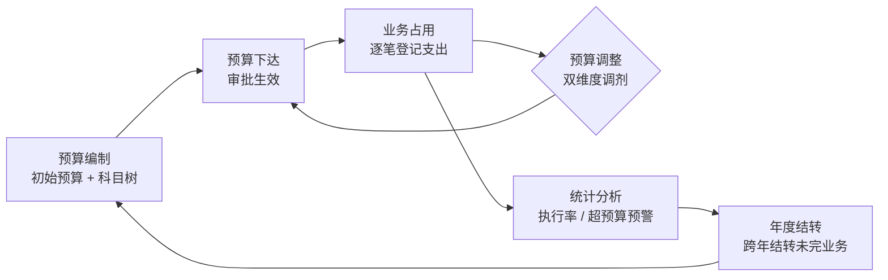

<div align="center">

# 预算管理系统 Budget Management System

**科研项目预算的全闭环管理 · 编制 → 下达 → 占用 → 调整 → 统计**

[](https://nextjs.org/)
[](https://react.dev/)
[](https://www.typescriptlang.org/)
[](https://www.prisma.io/)
[](https://www.postgresql.org/)
[](https://ant.design/)
[](#测试)
[](./LICENSE)

</div>

> 一个面向科研项目的 B/S 架构预算管理工具。围绕 **预算编制 → 预算下达 → 业务占用 → 预算调整 → 统计分析** 的完整闭环，提供精确到科目级的预算管控、实时占用聚合、审批流转与审计留痕。

---

## ✨ 核心特性

- 🔁 **全闭环预算管理** —— 从立项编制到结项统计，覆盖预算的完整生命周期
- 🌳 **树形科目体系** —— 直接费 / 间接费多级科目树，支持自定义科目与预设模板（PRD 附录 A）
- 📊 **实时占用聚合** —— 台账按 `已支出 + 应付未付` 实时计算占用、结余与执行率，无需手动结转
- ⚖️ **双维度预算调整** —— 一次调整同时处理「科目总预算」与「年度预算」两个维度，收支平衡校验 + 可调额度锁定
- ✅ **审批流转 + 审计留痕** —— 草稿 / 待审批 / 通过 / 驳回状态机，统一审计中间件记录前后快照
- 🔒 **预算锁机制** —— 调减额度在提交时即锁定，防止多张调整单累计超额
- 📥 **Excel 批量导入** —— 三段式预览（有效 / 错误 / 疑似重复），原子化确认防并发
- 📤 **台账导出** —— 一键导出年度执行台账为 Excel
- 🎯 **精确金额运算** —— 全链路 `decimal.js` 处理，杜绝浮点误差

## 🧭 预算管理闭环



## 🛠️ 技术栈

| 层           | 技术                                                                      |
| ------------ | ------------------------------------------------------------------------- |
| **前端**     | Next.js 16 (App Router) · React 19 · TypeScript 5 (strict) · Ant Design 5 |
| **后端**     | Next.js Route Handlers · Prisma 5 ORM · Zod 校验                          |
| **数据库**   | PostgreSQL 16                                                             |
| **金额运算** | decimal.js（全链路字符串传输，杜绝浮点误差）                              |
| **测试**     | Vitest（129 项集成测试，直连真实 PG）                                     |
| **工程化**   | ESLint · Prettier · Husky · commitlint · lint-staged                      |

## 🚀 快速开始

### 环境要求

- Node.js ≥ 20
- Docker（用于 PostgreSQL）
- pnpm / npm

### 1. 克隆 & 安装

```bash
git clone https://github.com/zweien/budget-management.git
cd budget-management
npm install
```

### 2. 配置环境变量

```bash
cp .env.example .env
# 默认配置已可对接 docker-compose 起的 PostgreSQL
```

### 3. 启动数据库

```bash
docker compose up -d          # PostgreSQL @ localhost:5434
```

### 4. 初始化数据库 & 种子数据

```bash
npx prisma migrate dev     # 应用 Prisma 迁移
npm run db:seed            # 写入 3 个角色用户 + 默认数据
```

### 5. 启动开发服务器

```bash
npm run dev                   # http://localhost:3000
```

### 6.（可选）预算调整导出 docx

预算调整的「导出 docx」功能按模板生成 Word 文档，依赖 `jszip`（已随 `npm install` 安装，纯 Node 实现，无需 Python）。开箱即用，无需额外配置。

> 仓库另附 `scripts/gen_adjustment_docx.py` 作为 Python（python-docx）实现的可选参考，默认未启用。

> 默认账号（V1 mock 鉴权，可在顶部切换身份）：
>
> - **张管理**（预算管理员 BUDGET_ADMIN）
> - **李负责人**（项目负责人 PROJECT_OWNER）
> - **王经办人**（经办人 AUTHORIZED_HANDLER）

## 📖 主要功能

| 模块           | 说明                                                           |
| -------------- | -------------------------------------------------------------- |
| **项目管理**   | 立项、起止时间、级别、归档                                     |
| **预算编制**   | 树形科目编辑器、预设模板、单位×数量×单价自动算金额、父节点汇总 |
| **预算审批**   | 提交 / 审批 / 驳回 / 撤回，审批中心统一待办                    |
| **预算调整**   | 双维度（总预算 + 年度）联动表单，收支平衡校验，可调额度锁定    |
| **业务记录**   | 逐笔登记支出（登记占位 / 合同 / 财务审批 / 已支出），实时占用  |
| **执行台账**   | 树形展示各科目预算/占用/结余/执行率，支持列显示控制与导出      |
| **到账流水**   | 登记项目到账资金                                               |
| **Excel 导入** | 批量导入业务记录，三段式预览 + 防并发确认                      |
| **年度结转**   | 跨年结转未完成业务记录                                         |
| **统计分析**   | 执行率、超预算预警、按月汇总                                   |
| **操作日志**   | 全量审计，前后快照留痕                                         |

## 🏗️ 项目结构

```
budget-management/
├── prisma/
│   ├── schema.prisma          # 数据模型(19 个模型)
│   ├── migrations/            # 数据库迁移
│   └── seed.ts                # 种子数据
├── src/
│   ├── app/
│   │   ├── (dashboard)/       # 页面(项目/台账/记录/调整/审批/统计...)
│   │   └── api/               # 41 个 Route Handler
│   ├── components/            # 复用组件(树形台账表、金额输入/展示...)
│   ├── lib/                   # 预算公式库(占用/可调额度/汇总)、decimal、鉴权
│   └── server/
│       └── services/          # 业务服务(编制/记录/调整/台账/导出/统计...)
└── tests/                     # Vitest 集成测试
```

## 🧮 关键设计

### 双维度预算调整

一次调整针对某年度，对每个科目同时调整两个维度：

| 科目     | 原总预算 | 总预算调整额 | 调整后总预算 | 原年度预算 | 年度调整额 | 调整后年度预算 |
| -------- | -------- | ------------ | ------------ | ---------- | ---------- | -------------- |
| 材料费   | 60,000   | -10,000      | **50,000**   | 60,000     | -10,000    | **50,000**     |
| 劳务费   | 40,000   | +10,000      | **50,000**   | 40,000     | +10,000    | **50,000**     |
| **汇总** |          | **0** ✓      |              |            | **0** ✓    |                |

- **两维度各自收支平衡**（Σ = 0），提交前强制校验
- 草稿允许不平衡，平衡校验推迟到提交审批
- 审批生效后 `SubjectBudget`（年度）与 `SubjectTotalBudget`（总预算）同步更新

### 实时占用聚合

```
总占用 = 已支出(PAID) + 应付未付(非 PAID 未作废)
可调额度 = 当前预算 - 总占用 - 待审批锁
```

台账的结余、执行率均实时计算，无需定时结转。

## 🧪 测试

```bash
npm test                       # 129 项集成测试(直连真实 PostgreSQL)
```

覆盖：编制审批、业务记录、双维度调整（含 §7.4/§7.5 可调额度与安全护栏）、台账上卷、Excel 导入、年度结转、统计、审计快照等。

## 📜 脚本

| 命令                     | 说明                |
| ------------------------ | ------------------- |
| `npm run dev`            | 开发服务器          |
| `npm run build`          | 生产构建            |
| `npm run start`          | 生产启动            |
| `npm test`               | 运行测试            |
| `npm run check-types`    | TypeScript 类型检查 |
| `npm run lint`           | ESLint              |
| `npx prisma migrate dev` | 应用数据库迁移      |
| `npm run db:seed`        | 写入种子数据        |

## 📄 文档

- [产品需求文档 PRD V1.0](./prd/预算管理系统_V1.0_PRD.md)

## 📝 License

[MIT](./LICENSE)
