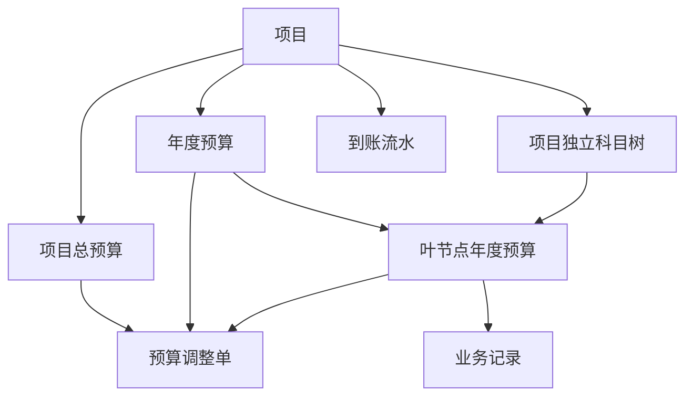
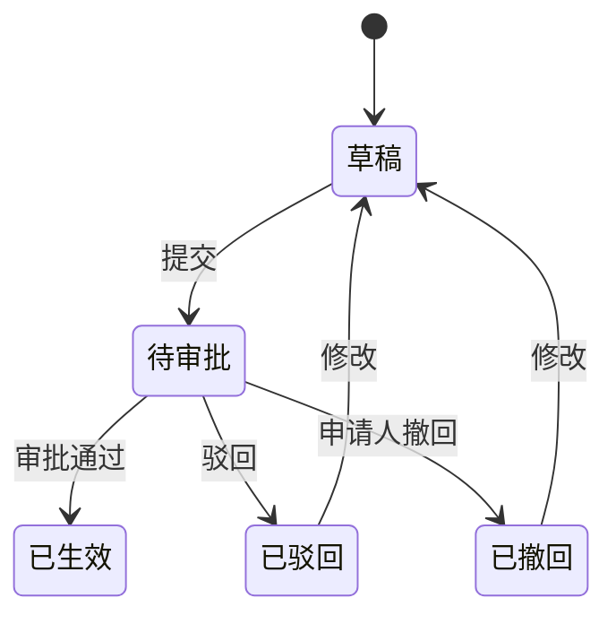
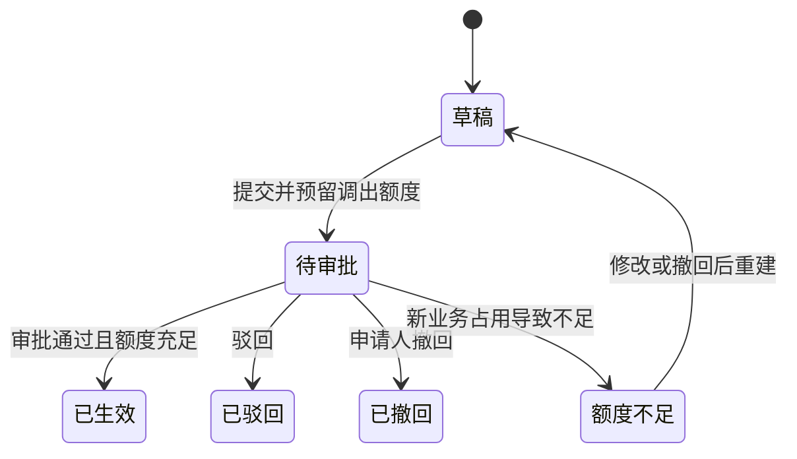

# 预算管理系统 V1.0 产品需求文档

> 文档状态：需求基线  
> 版本：V1.0  
> 更新日期：2026-07-30  
> 适用范围：首版研发、原型评审、测试验收

---

## 1. 产品概述

### 1.1 产品定位

预算管理系统是一套面向科研项目的 B/S 架构经费管理工具，用于统一管理项目总预算、年度预算、项目独立预算科目树、预算调整以及逐笔业务台账。

首版聚焦“预算编制—预算下达—业务占用—预算调整—统计分析”的主体闭环，目标是替代分散的 Excel 台账，让项目人员能够及时掌握预算、占用、支出、结余和调整过程。

### 1.2 核心价值

1. 建立统一、可追溯的项目预算数据源。
2. 以项目总预算、年度预算和叶节点科目预算形成逐级控制。
3. 将登记占位、合同、财务系统审批和已支出统一纳入预算占用。
4. 支持预算逐步细化、跨科目调剂和全过程审批留痕。
5. 提供固定视图和多条件组合统计，减少人工汇总。
6. 通过 Excel 校验预览导入，兼顾现有台账迁移和批量录入。

### 1.3 首版目标

- 完成项目预算从编制、审批、执行到调整的闭环。
- 支持项目负责人、授权预算经办人和预算管理员协作。
- 所有预算及业务变化可追溯、可重算、可导出。
- 重点页面操作清晰，适合科研人员日常使用。

### 1.4 首版不包含

- 拖拽式 BI 报表设计器、透视表设计器和图表设计器。
- 与财务系统的自动双向同步。
- 复杂多级会签、会签加签或条件审批流。
- 全局统一预算科目库。
- 科目停用／启用机制。
- 月末冻结快照和不可变财务结账。
- 以到账金额作为年度预算的硬性上限。

---

## 2. 用户角色与权限

### 2.1 角色定义

| 角色 | 定义 |
|---|---|
| 项目负责人 | 对指定项目的预算编制、预算执行和经办人授权负责 |
| 授权预算经办人 | 受项目负责人授权，参与指定项目的预算和业务维护 |
| 预算管理员 | 管理全部项目的预算审批、业务维护和全局查询 |

### 2.2 权限矩阵

| 功能 | 项目负责人 | 授权预算经办人 | 预算管理员 |
|---|:---:|:---:|:---:|
| 查看获授权项目 | ✓ | ✓ | 全部项目 |
| 编制项目初始预算 | ✓ | ✓ | ✓ |
| 维护初始科目树 | ✓ | ✓ | ✓ |
| 发起预算调整 | ✓ | ✓ | ✓ |
| 发起科目变更 | ✓ | ✓ | ✓ |
| 审批预算编制 | — | — | ✓ |
| 审批预算调整 | — | — | ✓ |
| 审批科目变更 | — | — | ✓ |
| 新增、修改业务记录 | ✓ | ✓ | ✓ |
| 作废业务记录 | ✓ | ✓ | ✓ |
| Excel 导入业务记录 | ✓ | ✓ | ✓ |
| 查看操作审计 | 项目范围 | 项目范围 | 全部项目 |

### 2.3 审批约束

- 预算编制、预算调整和科目变更均由预算管理员单级审批。
- 预算管理员可以发起业务单据，也可以审批自己发起的预算调整或科目变更。
- 首版不设置“申请人与审批人必须分离”的硬性约束。

---

## 3. 核心业务对象



| 业务对象 | 说明 |
|---|---|
| 项目 | 预算管理的边界，每个项目具有独立预算、人员权限和科目树 |
| 项目总预算 | 合同或任务书确定的预算总额及其调整后金额 |
| 年度预算 | 从项目总预算中按年度下达的可分配预算 |
| 预算科目 | 项目内部的多级树形科目；叶节点可编制预算和关联业务 |
| 初始预算编制单 | 一次性提交项目总预算、各年度预算和叶节点预算 |
| 预算调整单 | 调整项目总预算、年度预算或叶节点科目预算 |
| 科目变更单 | 新增、删除未使用科目，或修改科目名称、编码、说明 |
| 业务记录 | 一笔占用或支出事项，只关联一个年度和一个叶节点 |
| 到账流水 | 记录资金到账情况，仅作参考 |
| 操作日志 | 记录业务对象的创建、修改、提交、审批、作废和变更历史 |

---

## 4. 核心预算模型

### 4.1 预算层级


预算按以下三个层级逐级控制：

1. 项目当前总预算。
2. 各年度当前预算。
3. 各年度各叶节点科目当前预算。

### 4.2 项目总预算

- 初始总预算来源于合同或任务书。
- 项目总预算可通过预算调整增加或减少。
- 各年度当前预算合计不得超过项目当前总预算。
- 允许项目总预算尚未全部下达到具体年度。

公式：

```text
项目当前总预算 = 项目初始总预算 + 已生效项目总预算调整增量合计
项目待下达额度 = 项目当前总预算 - 各年度当前预算合计
```

### 4.3 年度预算

- 年度预算须从项目待下达额度中新增或调增。
- 年度预算调减后，释放金额重新计入项目待下达额度。
- 年度预算不要求全部分配到叶节点。
- 未使用的年度预算不自动结转到下一年度；新年度重新分配。

公式：

```text
年度当前预算 = 年度初始预算 + 已生效年度预算调整增量合计
年度未分配额度 = 年度当前预算 - 本年度全部叶节点当前预算合计
```

### 4.4 科目预算

- 预算只在叶节点编制和调整。
- 非叶节点金额等于其下全部叶节点金额之和，只读展示。
- 同年度叶节点当前预算合计不得超过年度当前预算。
- 允许保留年度未分配额度，用于后续新增或调增科目预算。

公式：

```text
叶节点当前预算 = 叶节点初始预算 + 已生效科目预算调整增量合计
非叶节点当前预算 = 其下所有叶节点当前预算之和
```

### 4.5 预算占用

四类有效业务状态都占用预算：

- 登记占位
- 合同
- 财务系统审批
- 已支出

作废记录不占用预算。

公式：

```text
已支出金额 = 状态为“已支出”的有效业务记录金额合计
应付未付 = 状态为“登记占位、合同、财务系统审批”的有效业务记录金额合计
总占用 = 已支出金额 + 应付未付
可用预算 = 当前预算 - 总占用
执行率 = 总占用 ÷ 当前预算
```

当当前预算为 0 时，执行率显示为“—”，不得产生除零错误。

---

## 5. 项目与预算科目

### 5.1 项目基础信息

首版项目至少包含：

| 字段 | 规则 |
|---|---|
| 项目名称 | 必填 |
| 项目编号 | 必填、系统内唯一 |
| 项目级别 | 可选文本或选项 |
| 起止时间 | 用于项目基本信息展示，不直接决定预算年度 |
| 项目负责人 | 必填 |
| 参与人员／授权经办人 | 可维护多名 |
| 经费信息 | 通过预算模块维护 |
| 备注 | 可选 |

项目状态的详细枚举不作为首版预算闭环的关键规则；业务实现可采用“正常／归档”两态满足列表管理，归档不删除历史数据。

### 5.2 项目独立科目树

- 每个项目维护独立的多级预算科目树。
- 不同项目的科目名称、层级和编码互不约束。
- 同名科目默认不跨项目自动合并。
- 层级数量不设置固定业务上限，但界面应支持至少四级。
- 非叶节点用于分类和汇总，叶节点用于预算和业务记录。

示例：

```text
直接费
├── 设备费
│   ├── 设备购置费
│   │   └── 服务器
│   └── 其他设备费
├── 材料费
├── 外部协作费
└── 会议、差旅费、国际合作交流费
    ├── 会议费
    ├── 差旅费
    └── 国际合作交流费
```

### 5.3 科目维护

- 项目负责人或授权经办人负责创建和调整项目科目树。
- 初始科目树随初始预算编制单提交。
- 初始预算生效后的结构变化通过科目变更单提交。
- 科目变更经预算管理员审批后生效。
- 草稿、待审批、驳回或撤回的变更不影响当前生效科目树。

### 5.4 已有数据科目的结构保护

只要科目已关联预算或业务记录：

- 不得删除。
- 不得移动到其他父节点。
- 不得改变叶节点／非叶节点属性。
- 可通过科目变更审批修改名称、编码和说明。

需要更换结构时，应新增科目，并通过预算调整将后续可用预算转移到新科目。原科目及历史数据保持不变。

从未关联预算或业务记录的科目，可通过科目变更审批删除、移动或改变节点属性。

### 5.5 不设置科目停用

- 系统不提供科目停用／启用状态。
- 不再使用某科目时，通过预算调减或同年度科目调剂处理其可用预算。
- 科目历史数据始终保留。
- 后续仍可重新向该科目分配预算并继续使用。

---

## 6. 初始预算编制

### 6.1 编制内容

初始预算编制单一次性包含：

1. 项目初始总预算。
2. 各年度初始预算。
3. 项目初始科目树。
4. 各年度叶节点科目初始预算。

### 6.2 编制流程



### 6.3 生效规则

- 项目负责人、授权预算经办人或预算管理员可编制。
- 由预算管理员单级审批。
- 审批通过后，总预算、年度预算、科目树和叶节点预算整体生效。
- 审批通过前不影响项目当前预算数据。
- 审批通过后，金额变更统一通过预算调整处理。
- 驳回后可修改并重新提交。

### 6.4 提交校验

- 项目初始总预算不得为负。
- 各年度初始预算合计不得超过项目初始总预算。
- 同年度叶节点初始预算合计不得超过该年度初始预算。
- 叶节点编码在项目内应唯一。
- 初始预算只允许填在叶节点。

---

## 7. 预算调整

### 7.1 调整类型

首版支持：

1. 项目总预算调增或调减。
2. 年度预算调增或调减。
3. 叶节点预算调增或调减。
4. 同年度叶节点间预算调剂。

同年度科目调剂不改变该年度预算总额；年度内部调增和调减必须金额平衡。

### 7.2 调整流程



### 7.3 发起与审批

- 项目负责人、授权预算经办人和预算管理员可发起。
- 所有预算调整均须审批通过后生效。
- 由预算管理员单级审批。
- 预算管理员可审批自己发起的调整。

### 7.4 可调额度

```text
科目可调额度 = 科目当前预算 - 科目总占用
可操作额度 = 科目当前预算 - 科目总占用 - 待审批调整锁定金额
```

- 调减或调剂的拟调出金额不得超过提交时的科目可调额度。
- 登记占位、合同、财务系统审批和已支出的金额都不得通过预算调整调走。
- 调整生效后，任何叶节点当前预算不得低于该节点总占用。
- 对父节点的汇总判断，应保证调整后其下全部叶节点预算合计不低于其下全部业务总占用。

### 7.5 待审批额度预留

- 调减或调剂提交后，系统记录拟调出金额为“待审批调整锁定金额”。
- 锁定不改变当前预算、总占用和执行率。
- 待审批调入金额不可提前使用。
- 驳回或撤回后，锁定金额立即释放。
- 业务记录仍可超过扣除锁定金额后的可操作额度提交，系统仅预警，不阻止保存。
- 因新增业务导致审批时可调额度不足的，调整不得审批通过。
- 系统不自动缩减调整金额，也不允许调整生效后形成预算倒挂。
- 申请人需修改或撤回后重新提交。

### 7.6 调整生效

审批通过时应在同一事务内：

1. 重新校验项目、年度和科目约束。
2. 重新校验所有调出科目的可调额度。
3. 写入预算调整明细。
4. 更新项目、年度和叶节点当前预算。
5. 释放待审批锁定。
6. 重新计算父节点汇总、结余和执行率。
7. 写入审批和审计日志。

---

## 8. 业务记录管理

### 8.1 记录字段

| 字段 | 必填 | 规则 |
|---|:---:|---|
| 项目 | ✓ | 用户只能选择有权限的项目 |
| 预算年度 | ✓ | 显式选择，不由日期自动判断 |
| 预算科目 | ✓ | 只能选择所选项目的叶节点 |
| 支出／占用金额 | ✓ | 大于 0 |
| 业务发生日期 | ✓ | 手工选择，可与预算年度不同 |
| 录入时间 | 系统 | 新建时记录当前时间 |
| 经办人 | ✓ | 文本字段 |
| 摘要 | ✓ | 文本字段 |
| 业务状态 | ✓ | 四种有效状态之一 |
| 备注 |  | 文本字段 |
| 创建人／修改人 | 系统 | 自动记录 |

### 8.2 一条记录一个科目

- 一条业务记录只能关联一个叶节点预算科目。
- 涉及多个科目时，按实际金额拆分为多条记录。
- Excel 模板同样遵循“一行一个叶节点科目”。
- 非叶节点不能直接关联业务记录。

### 8.3 业务状态

有效业务状态固定为：

| 状态 | 含义 | 预算影响 |
|---|---|---|
| 登记占位 | 初步登记、提前预留 | 计入应付未付和总占用 |
| 合同 | 已进入合同阶段 | 计入应付未付和总占用 |
| 财务系统审批 | 已进入财务审批 | 计入应付未付和总占用 |
| 已支出 | 已实际支付 | 计入已支出和总占用 |

- 四种状态之间可自由切换，不限制先后顺序。
- 状态切换后立即按新状态重算应付未付、已支出、总占用、结余和执行率。
- 所有状态变化保留修改前后值、操作人和时间。

### 8.4 超预算处理

- 新增或修改业务记录超过科目可用预算时，仍允许保存。
- 系统须在表单、确认步骤和结果页面明确预警。
- 可用预算允许为负数。
- 超预算记录仍计入总占用和执行率。
- 超预算不会自动增加预算，需另行发起预算调整。

### 8.5 修改

- 一般错误直接修改原记录。
- 修改金额、年度、科目、状态或业务发生日期后，立即重算受影响的原范围和新范围。
- 所属预算年度可以修改，但录入时间和业务发生日期均不得自动改变预算年度。
- 修改前后内容完整留痕。

### 8.6 作废

“作废”是记录生命周期标记，不是第五种业务状态：

- 重复、取消或失效记录可标记为已作废。
- 作废后立即解除预算占用。
- 作废记录不计入总占用、执行率和业务统计。
- 记录不物理删除，仍可在历史查询中查看。
- 必须记录作废人、作废时间和作废原因。

### 8.7 跨年度事项

- 业务记录录入时显式选择预算年度。
- 业务发生日期可与预算年度不同，仅用于查询、排序和月度统计。
- 年度未使用预算不自动结转。
- 年末仍处于登记占位、合同或财务系统审批的未支付事项，支持转入新年度，并优先占用新年度对应科目预算。
- 跨年处理应生成可追溯的结转记录，保留原年度归属、原状态和结转时间。
- 如新年度不存在对应科目或预算不足，系统须预警并要求人工确认处理，不得静默丢失占用。

---

## 9. 到账流水

### 9.1 功能定位

到账流水用于记录项目资金到账情况，为预算管理提供参考，但不作为年度预算的硬性上限。

### 9.2 基本要求

- 支持记录到账日期、到账金额、摘要、备注和录入人。
- 支持按项目查询到账累计金额和到账明细。
- 年度预算可高于或低于同期到账金额。
- 新到账资金不会自动增加年度预算；需要时通过预算调整下达。

---

## 10. Excel 批量导入与导出

### 10.1 导入流程


### 10.2 导入规则

- 上传后先解析和校验，不立即写入正式数据。
- 错误须定位到具体工作表、行号和字段。
- 用户确认后，选中的有效行才正式入库。
- 取消导入不产生业务记录。
- 正式导入后按每行的项目、年度和叶节点占用预算。
- 超预算行允许导入，但须明确预警。

### 10.3 疑似重复

系统至少按以下组合识别疑似重复：

- 项目
- 预算年度
- 叶节点科目
- 金额
- 业务发生日期
- 摘要（可作为辅助条件）

处理规则：

- 疑似重复行预警并默认不导入。
- 用户核实后可手动勾选并强制导入。
- 强制导入须记录操作人、时间和关联导入批次。

### 10.4 Excel 模板

模板采用“一行一条业务、一条业务一个叶节点”的结构，至少包含：

```text
项目编号、预算年度、科目编码、金额、业务发生日期、经办人、摘要、业务状态、备注
```

### 10.5 导出

- 固定统计视图支持导出当前范围的汇总和明细。
- 自定义统计支持导出当前筛选结果。
- 导出数据应包含筛选条件、导出时间和操作人。

---

## 11. 统计与展示

### 11.1 项目预算执行总览

按各级科目展示：

| 字段 | 口径 |
|---|---|
| 预算科目 | 树形展示 |
| 初始预算 | 初始编制生效金额 |
| 预算调整 | 已生效调整增量合计，可展开查看明细 |
| 当前总预算 | 初始预算 + 已生效调整 |
| 往年支出 | 所选年度以前、状态为已支出的有效记录 |
| 当年支出 | 所选年度、状态为已支出的有效记录 |
| 累计支出 | 往年支出 + 当年支出 |
| 应付未付 | 三类非已支出有效记录 |
| 总占用 | 累计支出 + 应付未付 |
| 结余 | 当前总预算 - 总占用 |
| 执行率 | 总占用 ÷ 当前总预算 |

### 11.2 年度预算执行视图

按所选预算年度和各级科目展示：

| 字段 | 口径 |
|---|---|
| 预算科目 | 树形展示 |
| 当前总预算 | 项目层面当前预算汇总参考 |
| 当年预算 | 所选年度科目当前预算 |
| 当年支出 | 所选预算年度、状态为已支出的有效记录 |
| 应付未付 | 所选预算年度三类非已支出有效记录 |
| 当年总占用 | 当年支出 + 应付未付 |
| 当年结余 | 当年预算 - 当年总占用 |
| 当年执行率 | 当年总占用 ÷ 当年预算 |

### 11.3 自定义统计

支持组合筛选：

- 项目
- 预算年度
- 预算科目
- 业务状态
- 业务发生日期范围
- 经办人
- 是否作废

结果包含：

- 筛选范围内的预算、已支出、应付未付、总占用、结余和执行率。
- 业务明细列表。
- 汇总与明细导出。
- 清空和重置筛选。

首版不保存自定义报表模板。

### 11.4 月度历史统计

- 按当前有效业务记录动态重算。
- 以业务发生日期归入月份。
- 修改或作废历史记录后，相关历史月份同步变化。
- 首版不建立月末冻结快照。

### 11.5 跨项目统计

- 可按项目汇总总预算、年度预算、总占用、已支出、结余和执行率。
- 因各项目科目树独立，同名科目默认不自动合并。
- 首版不提供跨项目标准科目映射。

---

## 12. 页面与交互需求

### 12.1 页面清单

| 页面 | 主要内容 |
|---|---|
| 工作台 | 项目概览、预算指标、风险预警、待审批事项 |
| 项目列表 | 项目查询、权限范围、预算概览 |
| 项目详情 | 总预算、年度预算、科目树、业务与调整入口 |
| 预算编制 | 总预算、年度预算和科目预算一体化编辑 |
| 预算执行台账 | 树形预算表、占用和结余指标、明细下钻 |
| 业务记录 | 列表、新增、修改、作废和批量导入 |
| 预算调整 | 调整明细、调出／调入、额度校验、提交 |
| 科目变更 | 科目树差异预览和审批 |
| 审批中心 | 预算编制、预算调整、科目变更待办 |
| 到账流水 | 到账登记和项目到账汇总 |
| 统计分析 | 固定视图、多条件筛选和导出 |
| 操作日志 | 对象、动作、操作人、时间和前后值 |

### 12.2 通用交互

- 金额统一右对齐，默认保留两位小数。
- 负结余使用醒目风险色，并显示“超预算”标识。
- 非叶节点与叶节点在科目树中使用不同图标或视觉层级。
- 所有审批单须提供申请前后对比。
- 校验错误必须说明对象、原因和处理方法。
- 提交、审批、作废等关键操作需二次确认。
- 列表支持分页、排序、筛选和导出。

### 12.3 原型索引

每个页面同时提供 PNG 预览图和可继续编辑的 SVG 源图。

- [01 工作台](prototypes/01-工作台.png) · [SVG](prototypes/01-工作台.svg)
- [02 项目预算执行台账](prototypes/02-预算执行台账.png) · [SVG](prototypes/02-预算执行台账.svg)
- [03 业务记录](prototypes/03-业务记录.png) · [SVG](prototypes/03-业务记录.svg)
- [04 预算调整](prototypes/04-预算调整.png) · [SVG](prototypes/04-预算调整.svg)
- [05 Excel 导入预览](prototypes/05-Excel导入预览.png) · [SVG](prototypes/05-Excel导入预览.svg)

---

## 13. 关键校验与提示

### 13.1 硬校验

以下情况禁止提交或禁止审批生效：

- 年度预算合计超过项目当前总预算。
- 年度叶节点预算合计超过年度当前预算。
- 预算编制或调整金额为非法值。
- 预算只读父节点被直接填入金额。
- 业务记录关联非叶节点。
- 预算调整审批时调出额度不足。
- 调整后科目当前预算低于总占用。
- 已有关联数据的科目被删除、移动或改变节点属性。
- 项目编号重复。

### 13.2 软预警

以下情况允许继续，但须明确提示：

- 新增或修改业务记录导致可用预算为负。
- Excel 导入行导致超预算。
- 疑似重复导入。
- 业务发生日期与预算年度不一致。
- 待审批预算调整已预留额度，新增业务将占用该额度。
- 跨年未支付事项在新年度对应科目预算不足。

---

## 14. 审计与数据一致性

### 14.1 审计范围

以下操作必须记录：

- 初始预算编制、提交、撤回、驳回、审批。
- 预算调整创建、修改、提交、撤回、驳回、审批。
- 科目新增、删除、移动、改名、改编码、改说明。
- 业务记录新增、修改、状态切换和作废。
- Excel 导入、疑似重复强制导入。
- 到账流水新增和修改。

日志至少包含：

```text
对象类型、对象编号、项目、动作、操作人、操作时间、修改前值、修改后值、原因／意见、关联单据
```

### 14.2 一致性要求

- 预算调整审批必须使用数据库事务保证原子性。
- 业务修改须同时重算原年度／原科目和新年度／新科目。
- 父节点统计不得存储为可人工修改数据，应由叶节点汇总生成。
- 所有金额计算使用定点小数，不使用二进制浮点数。
- 删除采用业务约束或逻辑保留，不得破坏历史审计链。

---

## 15. 非功能需求

### 15.1 易用性

- 桌面端优先，兼容常见现代浏览器。
- 预算树形表在 1440 px 宽度下可完整操作。
- 常用业务记录新增流程不超过一个主表单。
- 复杂规则采用即时校验和可读提示，不要求用户理解底层公式。

### 15.2 性能

- 常规列表和项目详情页面在正常内网环境下应快速响应。
- 万级业务记录下，分页查询、组合筛选和汇总应可用。
- Excel 导入采用后台解析或分步处理，避免页面长时间无反馈。

### 15.3 安全

- 用户只能访问获授权项目；预算管理员可访问全部项目。
- 服务端必须再次校验权限和预算规则，不能只依赖前端。
- 导出和审批等敏感操作记录审计日志。

### 15.4 可维护性

- 预算公式集中实现，避免不同页面各自计算形成口径差异。
- 业务状态、审批状态和调整类型使用稳定枚举。
- Excel 模板须带版本号，导入批次记录模板版本。
- 数据库应支持备份和恢复。

---

## 16. 核心数据模型建议

> 本节为满足已确认业务规则的逻辑模型，不限定具体数据库产品。

| 数据实体 | 关键字段 |
|---|---|
| users | id、name、role、status |
| projects | id、code、name、level、start_date、end_date、owner_id、remark、archived_at |
| project_members | project_id、user_id、member_role、authorized_at |
| budget_subjects | id、project_id、parent_id、code、name、description、level、is_leaf |
| initial_budget_applications | id、project_id、status、applicant_id、submitted_at、approver_id、approved_at、opinion |
| project_budgets | project_id、initial_amount、adjustment_amount、current_amount |
| annual_budgets | id、project_id、year、initial_amount、adjustment_amount、current_amount |
| subject_budgets | id、project_id、year、subject_id、initial_amount、adjustment_amount、current_amount |
| budget_adjustments | id、project_id、type、status、reason、applicant_id、approver_id、timestamps |
| budget_adjustment_lines | adjustment_id、level_type、year、subject_id、direction、amount |
| budget_locks | adjustment_id、project_id、year、subject_id、amount、released_at |
| subject_change_applications | id、project_id、status、before_snapshot、after_snapshot、audit_fields |
| business_records | id、project_id、budget_year、subject_id、amount、business_date、handler、summary、status、remark、is_void |
| business_record_history | business_record_id、action、before_data、after_data、operator_id、operated_at、reason |
| receipt_records | id、project_id、receipt_date、amount、summary、remark、creator_id |
| import_batches | id、project_id、file_name、template_version、status、creator_id、timestamps |
| import_rows | batch_id、row_no、parsed_data、validation_status、errors、duplicate_flag、forced_import |
| approval_logs | object_type、object_id、action、operator_id、opinion、operated_at |
| audit_logs | project_id、object_type、object_id、action、before_data、after_data、operator_id、operated_at |

### 16.1 关键唯一性

- `projects.code` 系统内唯一。
- `budget_subjects(project_id, code)` 项目内唯一。
- `annual_budgets(project_id, year)` 唯一。
- `subject_budgets(project_id, year, subject_id)` 唯一。

### 16.2 金额字段

- 金额统一使用不低于 `decimal(18,2)` 的定点小数。
- 数据库和后端均禁止使用浮点数存储或计算预算。

---

## 17. 验收标准

### 17.1 预算编制

- 能一次性提交总预算、年度预算、科目树和叶节点预算。
- 超过上级额度时不能提交。
- 审批通过前不影响当前预算，审批通过后整体生效。

### 17.2 科目树

- 支持多级项目独立科目树。
- 父节点自动汇总，不能录入预算或关联业务。
- 已有数据科目无法删除、移动或改变叶节点属性。

### 17.3 预算调整

- 支持总预算、年度预算、科目预算调整和同年度科目调剂。
- 提交后显示锁定金额。
- 审批时额度不足不能通过。
- 审批通过后预算、汇总、结余和执行率同步更新。

### 17.4 业务记录

- 一条记录只关联一个预算年度和一个叶节点。
- 四种状态均计入总占用，已支出与应付未付分别统计。
- 状态可自由切换并保留历史。
- 超预算可保存且有明显预警。
- 作废后解除占用但记录仍可查询。

### 17.5 Excel 导入

- 上传后先预览，不直接写入。
- 错误定位到行和字段。
- 疑似重复默认不导入，可强制导入并留痕。
- 确认导入后预算统计正确重算。

### 17.6 统计

- 固定视图口径与本 PRD 公式一致。
- 自定义统计支持多条件组合筛选、汇总、明细和导出。
- 历史月份会随记录修改或作废动态重算。

### 17.7 审计

- 可查看预算、科目和业务记录的完整变更链。
- 关键日志包含操作人、时间、前后值和原因／意见。

---

## 18. 一致性说明

本需求基线对前期讨论中的相近概念作如下统一：

1. “已取消／作废”统一作为业务记录生命周期标记，不作为第五种有效业务状态。
2. 预算占用始终按四种有效状态计算；作废记录不占用。
3. “锁定额度”对预算调整审批是硬校验，对新增业务是提示性预留。
4. 业务预算年度由用户显式选择；跨年未支付事项通过可追溯的年度结转处理，不由录入日期或业务发生日期自动改年。
5. 科目不设置停用状态；不再使用时通过预算调整处理剩余可用额度。
6. 历史月度数据采用动态重算，不作为冻结财务报表。

---

## 附录 A：默认预算科目示例

以下仅作为新项目初始化参考，不构成全局统一科目库：

```text
直接费
├── 设备费
│   ├── 设备购置费
│   └── 其他设备费
├── 材料费
├── 外部协作费
├── 燃料动力费
├── 会议、差旅费、国际合作交流费
│   ├── 会议费
│   ├── 差旅费
│   └── 国际合作交流费
├── 出版、文献、信息传播、知识产权事务费
├── 劳务费
├── 专家咨询费
└── 其他支出

间接费
├── 科研绩效
└── 管理费
```

## 附录 B：业务状态与统计映射

| 记录生命周期 | 业务状态 | 已支出 | 应付未付 | 总占用 |
|---|---|:---:|:---:|:---:|
| 有效 | 登记占位 | 0 | 金额 | 金额 |
| 有效 | 合同 | 0 | 金额 | 金额 |
| 有效 | 财务系统审批 | 0 | 金额 | 金额 |
| 有效 | 已支出 | 金额 | 0 | 金额 |
| 已作废 | 任一原状态 | 0 | 0 | 0 |
